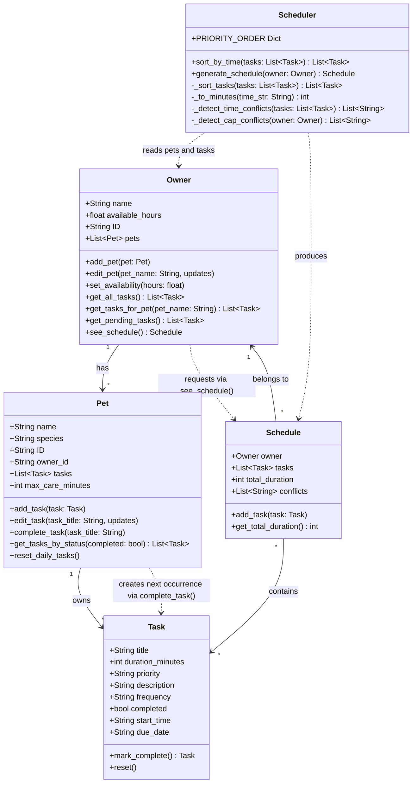

# PawPal+ — Final UML Class Diagram

> Render this diagram using the VS Code "Markdown Preview Mermaid Support" extension,
> or paste it into https://mermaid.live to export as PNG.

## Changes from initial design

| Change | Reason |
|---|---|
| Tasks moved from `Owner` to `Pet` | Tasks are naturally associated with a specific pet, not the owner globally |
| `Task` gained `start_time`, `due_date`, `frequency`, `completed` | Needed for time-based sorting, recurring logic, and conflict detection |
| `Pet` gained `complete_task()` and `max_care_minutes` | Handles recurrence auto-creation and per-pet care cap enforcement |
| `Owner` gained `get_all_tasks()`, `get_tasks_for_pet()`, `get_pending_tasks()` | Provides filtered views across all pets without the Scheduler needing direct pet access |
| `Schedule` gained `conflicts: List[str]` | Surfaces both time-overlap and care-cap warnings without crashing |
| `Scheduler` split conflict detection into `_detect_time_conflicts` and `_detect_cap_conflicts` | Separates two distinct types of warnings for clarity and testability |
| `Owner` and `Pet` gained `ID` / `owner_id` | Required for linking pets to owners and generating unique IDs in the UI |
